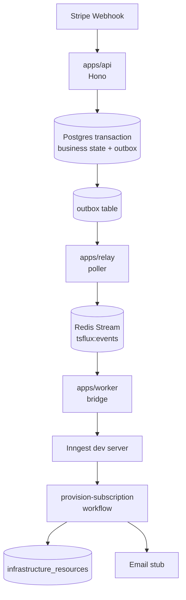

# ts-flux

Event-driven, durable execution backend for billing and infrastructure
provisioning. Implements the transactional outbox pattern, at-least-once
delivery with idempotency-key deduplication, and Inngest durable workflows.

## Architecture



**Guarantees**

- **BRD R1 — Stripe is the source of truth:** webhook handlers mirror Stripe
  state verbatim into `tenants`/`subscriptions`.
- **BRD R2 — Idempotency everywhere:** the Stripe event id is the outbox
  unique key; Redis `SET NX EX` locks gate workflow steps; unique keys on
  `infrastructure_resources` block duplicate provisioning.
- **BRD R3 — Atomic transitions:** business writes and outbox inserts share
  one Postgres transaction (`withTransaction`).
- The relay is **at-least-once**: a crash between publish and mark can
  duplicate a stream message, but duplicates are absorbed downstream. Events
  are never lost.

## Layout

| Path | Purpose |
|---|---|
| `apps/api` | Hono server: verifies Stripe signatures, writes business state + outbox atomically |
| `apps/relay` | Polls unprocessed outbox rows, publishes to Redis Streams |
| `apps/worker` | Consumes the stream, bridges to Inngest, serves workflow executor at `/api/inngest` |
| `packages/db` | Drizzle schema, client, `withTransaction`, seed, drizzle-kit config |
| `packages/events` | Zod schemas + typed registry for every domain event |
| `packages/broker` | Redis Streams publisher/consumer with reclaim + dead-lettering |
| `packages/idempotency` | Redis-backed `acquireLock`/`releaseLock` (injected client) |
| `packages/workflows` | Inngest client + `provision-subscription` workflow + activities |
| `scripts/` | Webhook simulator |

## Quickstart

```bash
# 1. Install dependencies
pnpm install

# 2. Start Postgres, Redis, and the Inngest dev server
docker compose up -d

# 3. Configure env
cp .env.example .env

# 4. Create tables and seed demo tenants (cus_test_alpha, cus_test_beta)
pnpm db:push
pnpm db:seed

# 5. Run all three processes
pnpm dev

# 6. Fire a webhook (in another terminal)
pnpm simulate:webhook
```

Watch the chain: API logs the atomic write → relay logs
`relay.batch_published` → worker forwards to Inngest → the Inngest UI at
<http://localhost:8288> shows the `provision-subscription` run → an
`infrastructure_resources` row appears and the email stub logs.

If the worker does not appear in the Inngest UI automatically, add
`http://host.docker.internal:3001/api/inngest` in the Apps tab.

### Proving the guarantees

```bash
# Duplicate webhook → second call returns 200, outbox row count unchanged,
# workflow run skipped ("already_processed").
pnpm simulate:webhook -- --event-id=evt_replay_1
pnpm simulate:webhook -- --event-id=evt_replay_1

# Enterprise plan for the second tenant
pnpm simulate:webhook -- --customer=cus_test_beta --plan=enterprise

# Lapsed subscription transition (emits subscription.updated)
pnpm simulate:webhook -- --status=past_due
```

## Scripts

| Command | Purpose |
|---|---|
| `pnpm dev` | Run api + relay + worker (+ library watch builds) via turbo |
| `pnpm build` | Build every package/app with tsup |
| `pnpm typecheck` | Workspace-wide `tsc` |
| `pnpm test` | Unit tests (integration tests auto-run when `DATABASE_URL`/`REDIS_URL` are reachable) |
| `pnpm db:push` / `db:generate` / `db:migrate` | drizzle-kit against `DATABASE_URL` |
| `pnpm db:seed` | Idempotent demo tenants |

## Design decisions & semantics

- **Idempotency locks are processed markers.** Held until TTL (1h default)
  after success; `releaseLock` is only for failures *before* any side effect.
  Releasing after success would reopen the duplicate window.
- **Event name mapping.** Outbox stores `subscription.activated`; Inngest
  listens on `app/subscription.activated`. The worker bridge owns the prefix.
- **Dead letters.** Stream messages that exceed `maxDeliveries` (default 5)
  or never parse land in `tsflux:events:dlq` with the reason.
- **Tenant resolution.** Tenants are resolved by `stripeCustomerId` from the
  Stripe object's `customer` field (the TRD sample conflated the two ids).
- **Stripe signature verification** is hand-rolled (HMAC-SHA256, `t=`/`v1=`
  parsing, 5-minute tolerance, constant-time compare) to avoid a `stripe`
  SDK dependency for webhook-only usage.

## Ports

| Service | Port |
|---|---|
| API | 3000 |
| Worker (Inngest executor) | 3001 |
| Relay health | 3002 |
| Postgres / Redis | 5432 / 6379 |
| Inngest dev server UI | 8288 |
